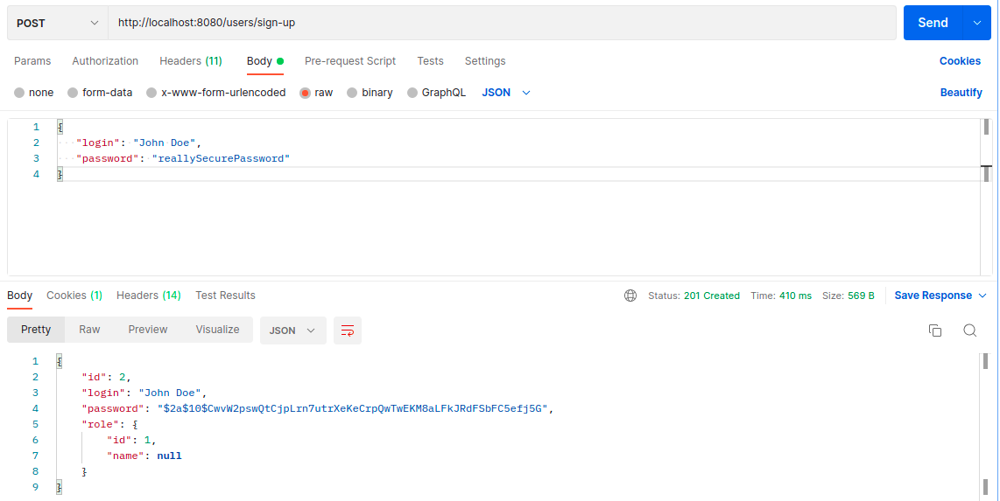
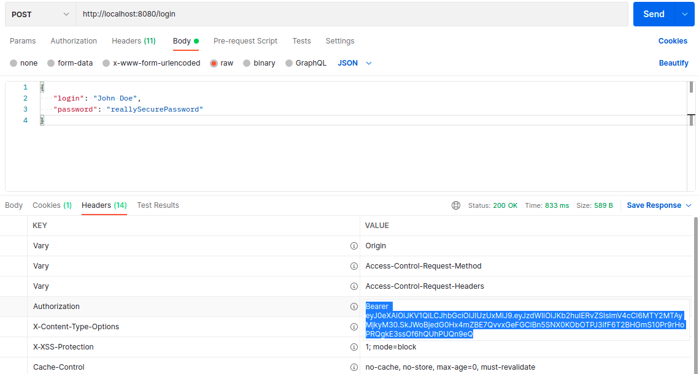
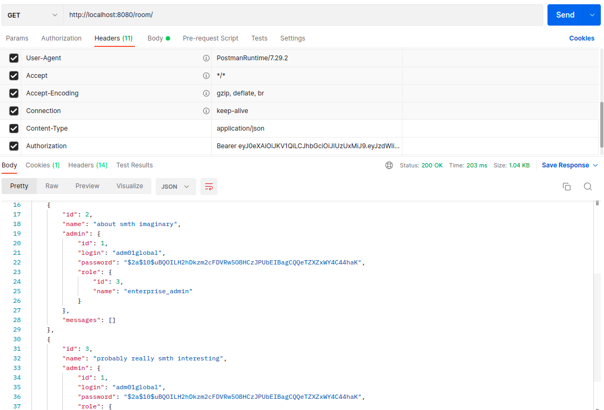

# job4j_chat

Creating a chat on the Rest API. 
REST API Implementation via Spring Boot. 
Contains four Person models. role. room, message. 
The application implements a chat with rooms.
  
 
in progress..

  

REST API: 

first, register user
  
then, login (Get JWT token for further authorization)
  
## then you need to use the received token to make requests. ##
all rooms:
  
 
further in progress..

