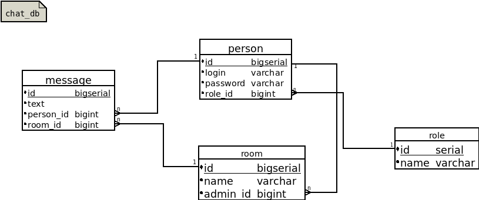

[](https://github.com/DenisYakovinov/job4j_chat/actions/workflows/maven.yml)
# job4j_chat

Creating a chat on the Rest API.<br>
REST API Implementation via Spring Boot.<br>
Contains four Person models. role. room, message.<br>
The application implements a chat with rooms.
<br> 
<br>
<h2>Technologies</h2>
<ul>
    <li>Spring Boot</li>
    <li>Spring MVC</li>
    <li>Spring Data JPA</li>
    <li>Spring AOP</li>
    <li>Spring Security</li>
    <li>Postgres</li>
    <Li>liquibase</Li>
</ul>
in progress..

 <br>

REST API:<br>

first, register user
 <br>
then, login (Get JWT token for further authorization)
 <br>
## then you need to use the received token to make a requests. ##
all rooms:
 <br>
<br>
create a new room:
 <br>
create a new message:
 <br>
get room with messages:
 <br>

To run the app (need at least java 11), clone the project
```
https://github.com/DenisYakovinov/job4j_chat.git
```
then using terminal from root directory:<br>

1. run db in docker
```
docker-compose up chat_db
```
2. then
```
mvn install
```
3. and run
```
java -jar target/job4j_chat-1.0-SNAPSHOT.jar
```
4. or
```
mvn spring-boot:run
```
